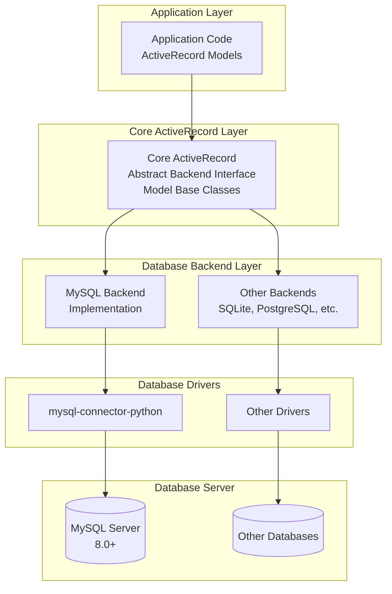
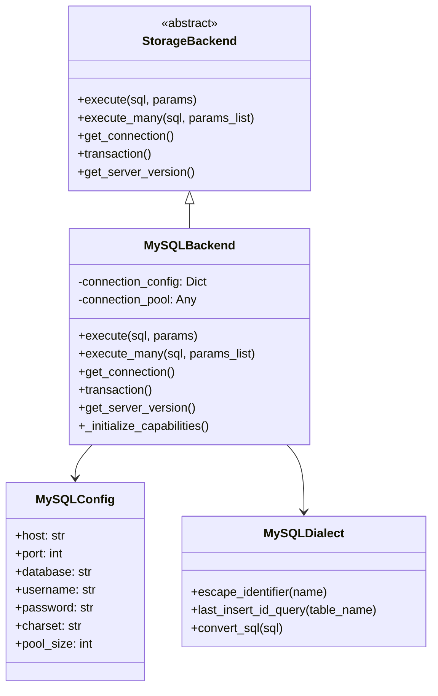
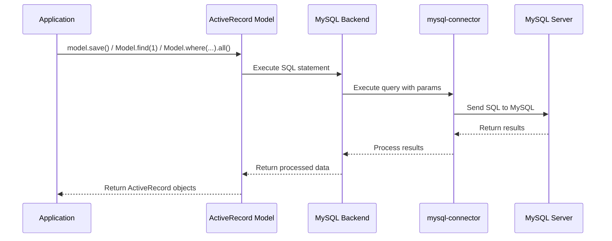
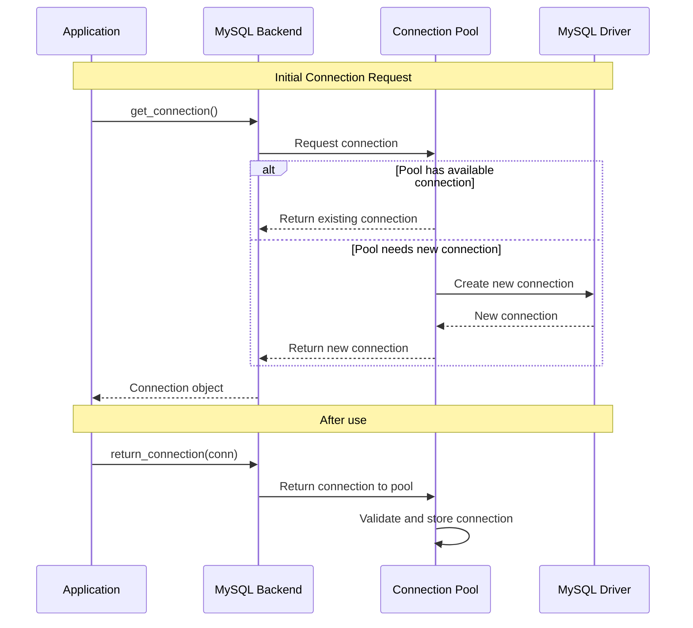
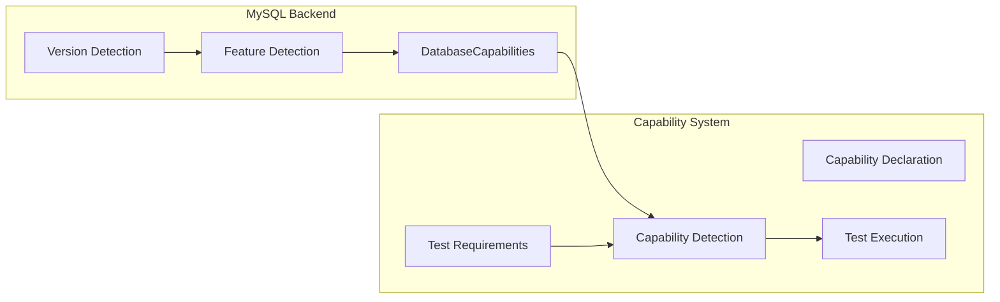
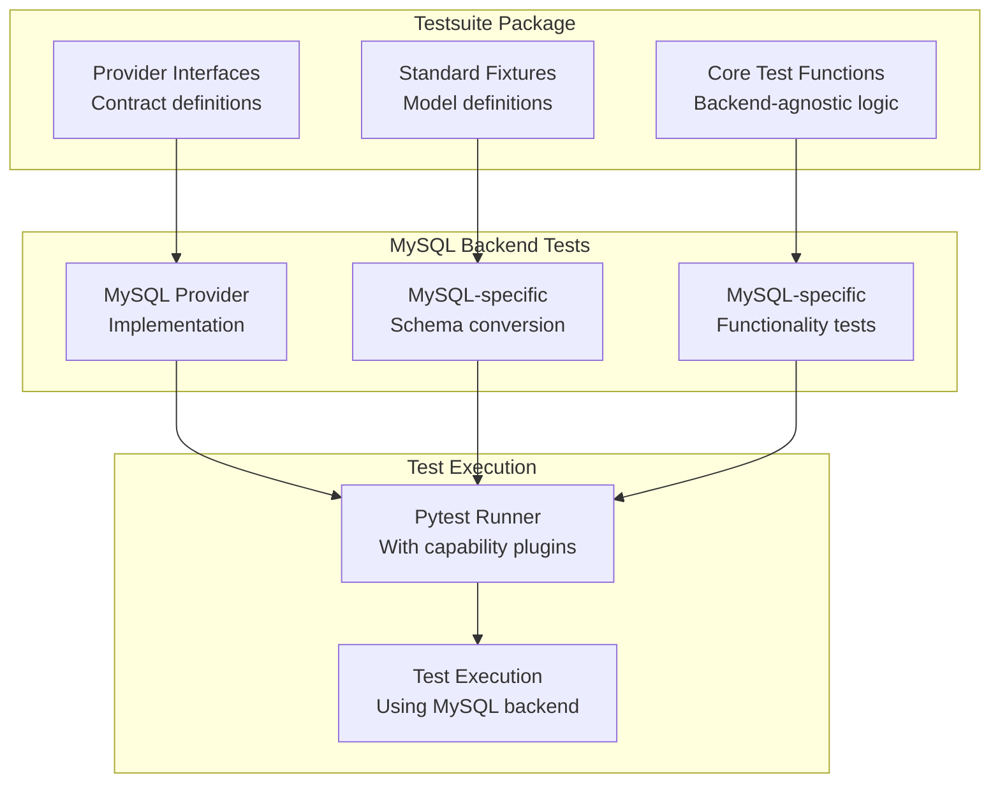

# MySQL Backend Architecture for RhoSocial ActiveRecord

## System Overview

The MySQL backend for RhoSocial ActiveRecord is designed as a pluggable component that extends the core ActiveRecord functionality with MySQL-specific features and optimizations. It follows a modular architecture that separates core ActiveRecord patterns from database-specific implementations.

## High-Level Architecture



## Component Architecture

### 1. Core Backend Interface

The core ActiveRecord defines an abstract interface that all backends must implement:

```python
from abc import ABC, abstractmethod
from typing import Any, Dict, List, Optional, Tuple

class StorageBackend(ABC):
    """Abstract interface for storage backends."""
    
    @abstractmethod
    def execute(self, sql: str, params: Optional[Tuple] = None) -> Any:
        """Execute SQL query."""
        pass
    
    @abstractmethod
    def execute_many(self, sql: str, params_list: List[Tuple]) -> None:
        """Execute SQL query multiple times with different parameters."""
        pass
    
    @abstractmethod
    def get_connection(self) -> Any:
        """Get a database connection."""
        pass
    
    @abstractmethod
    def transaction(self) -> Any:
        """Get a transaction context manager."""
        pass
    
    @abstractmethod
    def get_server_version(self) -> Tuple[int, ...]:
        """Get database server version."""
        pass
```

### 2. MySQL Backend Implementation

The MySQL backend implements the storage interface with MySQL-specific functionality:



### 3. MySQL Backend Components

#### Backend Core (`backend.py`)
- Implements the `StorageBackend` abstract interface
- Manages MySQL connections and connection pooling
- Handles query execution and results
- Manages transaction handling

#### Configuration (`config.py`)
- Handles MySQL-specific configuration loading
- Supports multiple configuration sources (file, environment, direct)
- Manages connection string construction

#### SQL Dialect (`dialect.py`)
- MySQL-specific SQL syntax handling
- Query generation for MySQL compatibility
- Identifier escaping for MySQL
- MySQL-specific functions and syntax

#### Type System (`types.py`, `type_converters.py`)
- MySQL-specific data type mappings
- Type conversion between Python and MySQL types
- Custom type support (JSON, ENUM, SET, etc.)

#### Transaction Management (`transaction.py`)
- MySQL-specific transaction handling
- Savepoint support
- Transaction isolation levels

## Data Flow Architecture

### Query Execution Flow



### Connection Management Flow



## Capability System Architecture

The MySQL backend reports its capabilities to enable selective test execution and feature detection:



### Capability Categories

The MySQL backend declares support for these capability categories:

1. **CTE (Common Table Expressions)**: Basic, recursive, and materialized CTEs
2. **JSON Operations**: JSON_EXTRACT, JSON_SEARCH, JSON_TABLE, etc.
3. **Window Functions**: ROW_NUMBER, RANK, LAG, LEAD, etc.
4. **Full-Text Search**: MATCH...AGAINST operations
5. **Advanced Grouping**: CUBE, ROLLUP operations
6. **Connection Features**: Pooling, SSL, etc.

## Testing Architecture Integration

The MySQL backend seamlessly integrates with the shared test suite:



### Provider Pattern Implementation

The MySQL backend implements the provider pattern to work with shared tests:

```python
class MySQLTestProvider(ITestProvider):
    """Provider implementation for MySQL backend tests."""
    
    def setup_basic_fixtures(self, scenario_name: str) -> Tuple[Type[ActiveRecord], ...]:
        """Setup basic models with MySQL backend."""
        # Configure models with MySQL backend
        # Convert SQLite schemas to MySQL syntax
        # Return tuple of configured models
        pass
    
    def setup_query_fixtures(self, scenario_name: str) -> Tuple[Type[ActiveRecord], ...]:
        """Setup query models with MySQL backend."""
        pass

    def get_backend_capabilities(self) -> DatabaseCapabilities:
        """Get MySQL backend capabilities for test selection."""
        pass
```

## Deployment Architecture

### Package Distribution

The MySQL backend is distributed as a separate package to maintain modularity:

```
rhosocial-activerecord (core) - Required
├── rhosocial-activerecord-mysql (this package) - Optional
├── rhosocial-activerecord-pgsql - Optional
├── rhosocial-activerecord-testsuite - Optional (for testing)
└── Application - Uses chosen backend
```

### Environment Setup

The architecture supports multiple deployment environments:

1. **Development**: Direct source code with editable installation
2. **Testing**: MySQL server with test database and schema
3. **Production**: Connection pooling and optimized settings
4. **CI/CD**: Automated testing with MySQL service containers

## Security Architecture

### Connection Security
- SSL/TLS support for encrypted connections
- Connection pooling with secure credential handling
- SQL injection prevention through parameterization

### Data Security
- Type-safe data handling through converter system
- Proper escaping of identifiers and data
- Isolation of database operations from application logic

## Performance Architecture

### Connection Pooling
- Configurable pool sizes based on application needs
- Automatic connection validation and reconnection
- Efficient resource utilization under load

### Query Optimization
- Prepared statement support
- Batch operation capabilities
- MySQL-specific query optimizations
- Index utilization awareness

This architecture enables the MySQL backend to provide robust, secure, and performant database access while maintaining compatibility with the core ActiveRecord patterns and supporting the shared test suite ecosystem.