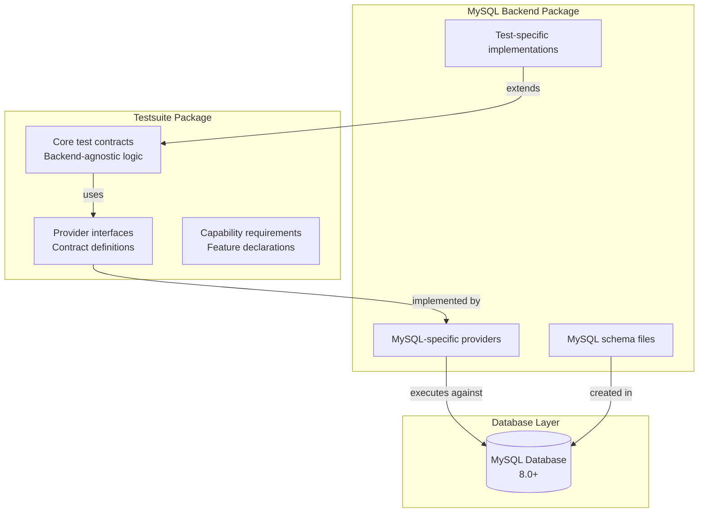

# MySQL Backend Testing Guide for RhoSocial ActiveRecord

> **AI Assistant Note**: This document is optimized for AI code assistants (Claude Code, Gemini CLI, etc.). It uses imperative language and front-loads critical execution requirements.

## Overview

The MySQL backend for RhoSocial ActiveRecord is distributed as a separate package (`rhosocial-activerecord-mysql`) that extends the core `rhosocial-activerecord` package. It provides MySQL-specific database functionality while maintaining compatibility with the shared test suite.

## Repository Structure

### Core Package Dependencies
- **Main Package**: `rhosocial-activerecord` (provides core ActiveRecord functionality)
- **Testsuite Package**: `rhosocial-activerecord-testsuite` (provides standardized test contracts)
- **Backend Package**: `rhosocial-activerecord-mysql` (MySQL-specific implementation)

### Directory Organization

```
rhosocial-activerecord-mysql/
├── src/
│   └── rhosocial/
│       └── activerecord/
│           └── backend/
│               └── impl/
│                   └── mysql/     # MySQL backend implementation
│                       ├── __init__.py            # Module exports and version info (__version__, __all__)
│                       ├── backend.py              # Core backend implementation
│                       ├── config.py              # MySQL-specific configuration
│                       ├── dialect.py             # MySQL-specific SQL dialect
│                       ├── transaction.py         # Transaction handling
│                       ├── types.py               # MySQL-specific type handling
│                       └── type_converters.py     # Type conversion utilities
├── tests/
│   ├── rhosocial/
│   │   └── activerecord_mysql_test/     # Backend-specific tests using shared fixtures
│   │       ├── feature/                  # Core functionality tests
│   │       │   ├── backend/             # Backend interface tests
│   │       │   ├── basic/               # Basic CRUD operations
│   │       │   ├── events/              # Event hooks and lifecycle
│   │       │   ├── mixins/              # Built-in mixin functionality
│   │       │   ├── query/               # Query building and execution
│   │       │   └── relation/            # Relationship functionality
│   │       └── realworld/               # Business scenario tests
│   ├── providers/                      # Test provider implementations
│   ├── config/                         # Configuration files
│   ├── conftest.py                     # Pytest configuration
│   └── config_manager.py               # Configuration management utilities
└── .gemini/
    └── testing.md               # This knowledge base file
```

## Package Dependencies and Relationships

### MySQL Backend Dependencies
The MySQL backend package has these critical dependencies:

1. **Core Package**: `rhosocial-activerecord>=0.9.0,<2.0.0`
2. **MySQL Driver**: `mysql-connector-python>=9.3.0`
3. **Testsuite**: `rhosocial-activerecord-testsuite` (for test reuse)

### Testing Dependencies
```toml
[project.optional-dependencies]
test = [
    "pytest>=7.0.0",
    "coverage>=7.0.0",
    "pytest-asyncio>=0.10.0", 
    "pytest-cov>=4.0.0",
    "rhosocial-activerecord[test]>=0.9.0,<2.0.0",
    "rhosocial-activerecord-testsuite",
]
```

## Testing Architecture

### Two-Tier Testing Approach

The MySQL backend uses a two-tier testing approach:

1. **Shared Test Suite**: Reuses tests from `rhosocial-activerecord-testsuite` to ensure compatibility
2. **MySQL-Specific Tests**: Validates MySQL-specific features and optimizations



### Shared Test Reuse Pattern

The MySQL backend reuses core tests while providing MySQL-specific implementations:

```python
# Import core test class and extend with MySQL backend
from rhosocial.activerecord_test.basic.test_crud import TestCRUD
from rhosocial.activerecord.backend.impl.mysql import MySQLBackend

class TestMySQLCRUD(TestCRUD):
    """Run shared CRUD tests with MySQL backend."""
    
    @pytest.fixture(scope='class')
    def backend(self, mysql_config):
        """Provide MySQL backend for tests."""
        backend = MySQLBackend(**mysql_config)
        yield backend
        backend.close()
    
    @pytest.fixture(autouse=True)
    def setup_schema(self, backend):
        """Load MySQL-specific schema before each test."""
        # Convert SQLite schemas from shared tests to MySQL syntax
        schema_sql = self.convert_sqlite_to_mysql(
            self.load_shared_schema('users')
        )
        backend.execute(schema_sql)
        yield
        backend.execute("DROP TABLE IF EXISTS users")
    
    def convert_sqlite_to_mysql(self, sql):
        """Convert SQLite-specific syntax to MySQL."""
        conversions = {
            'AUTOINCREMENT': 'AUTO_INCREMENT',
            'INTEGER PRIMARY KEY': 'INT PRIMARY KEY',
            'BOOLEAN': 'TINYINT(1)',
        }
        for old, new in conversions.items():
            sql = sql.replace(old, new)
        return sql
```

## MySQL-Specific Capabilities

### MySQL Version Support

The backend is designed to work with MySQL 8.0+, supporting:

1. **JSON Type**: Native JSON column support
2. **Window Functions**: Advanced analytical functions
3. **Common Table Expressions**: Recursive and materialized CTEs
4. **Full-Text Search**: MATCH...AGAINST functionality
5. **Connection Pooling**: Built-in connection pooling

### Capability Declaration

MySQL backend declares its capabilities through the `DatabaseCapabilities` system:

```python
# In src/rhosocial/activerecord/backend/impl/mysql/backend.py
from rhosocial.activerecord.backend.capabilities import (
    DatabaseCapabilities,
    CTECapability,
    WindowFunctionCapability,
    ALL_CTE_FEATURES,
    ALL_WINDOW_FUNCTIONS
)

class MySQLBackend(StorageBackend):
    def _initialize_capabilities(self):
        """Initialize and return the backend's capability descriptor."""
        capabilities = DatabaseCapabilities()
        version = self.get_server_version()

        # JSON operations supported from MySQL 5.7+
        if version >= (5, 7, 0):
            capabilities.add_json_operation([
                JSONCapability.BASIC_JSON,
                JSONCapability.JSON_EXTRACT,
                JSONCapability.JSON_SEARCH,
                JSONCapability.JSON_TABLE
            ])

        # CTEs supported from MySQL 8.0+
        if version >= (8, 0, 0):
            capabilities.add_cte(ALL_CTE_FEATURES)

        # Window functions from MySQL 8.0+
        if version >= (8, 0, 0):
            capabilities.add_window_function(ALL_WINDOW_FUNCTIONS)

        return capabilities
```

## MySQL-Specific Features Testing

### JSON Operations

```python
# tests/test_mysql_json.py
def test_mysql_json_operations(mysql_backend):
    """Test MySQL-specific JSON functionality."""
    mysql_backend.execute("""
        CREATE TABLE json_test (
            id INT PRIMARY KEY AUTO_INCREMENT,
            data JSON
        )
    """)
    
    class JSONTest(ActiveRecord):
        __backend__ = mysql_backend
        __tablename__ = 'json_test'
        id: int
        data: dict
    
    # Test JSON insertion and extraction
    test_record = JSONTest(data={'name': 'John', 'age': 30})
    test_record.save()
    
    result = JSONTest.where(
        "JSON_EXTRACT(data, '$.name') = %s", 
        ['John']
    ).first()
    
    assert result is not None
    assert result.data['name'] == 'John'
```

### Full-Text Search

```python
# tests/test_mysql_fulltext.py
def test_mysql_fulltext_search(mysql_backend):
    """Test MySQL FULLTEXT search capability."""
    mysql_backend.execute("""
        CREATE TABLE articles (
            id INT PRIMARY KEY AUTO_INCREMENT,
            title VARCHAR(200),
            content TEXT,
            FULLTEXT KEY (title, content)
        )
    """)
    
    class Article(ActiveRecord):
        __backend__ = mysql_backend
        __tablename__ = 'articles'
        id: int
        title: str
        content: str
    
    # Insert sample data
    Article(title="Python Programming", 
           content="Learn Python programming language").save()
    
    # Test fulltext search
    results = Article.where(
        "MATCH(title, content) AGAINST(%s IN NATURAL LANGUAGE MODE)",
        ["Python"]
    ).all()
    
    assert len(results) == 1
    assert results[0].title == "Python Programming"
```

## Test Execution Requirements

### CRITICAL: PYTHONPATH Configuration

**MUST configure PYTHONPATH before running tests.** This is required because the test structure imports from `rhosocial.activerecord` and `rhosocial.activerecord_test`.

### Platform-Specific Commands

**Linux/macOS (bash/zsh):**
```bash
# Single command execution
export PYTHONPATH=src:tests
pytest tests/

# Persistent for session
export PYTHONPATH=src:tests
pytest tests/
```

**Windows (PowerShell 7+):**
```powershell
# Single command execution
$env:PYTHONPATH="src:tests"; pytest tests/

# Persistent for session
$env:PYTHONPATH="src:tests"
pytest tests/
```

## MySQL-Specific Test Configuration

### Configuration Management

The tests use a flexible configuration management system that supports multiple MySQL server instances through a priority-based loading mechanism:

1. **Environment Variable Specified Config File** (`MYSQL_ACTIVERECCORD_CONFIG_PATH`)
2. **Default Config File** (`config.json` in project root)
3. **Environment Variables for MySQL Connection Parameters**
4. **Hard-coded Default Values**

#### Configuration File Format

The system uses a JSON-based configuration file format. Use `config.example.json` as a template:

```json
{
  // MySQL connection configuration example
  // 
  // Usage:
  // 1. Copy this file to config.json
  //    cp config.example.json config.json
  // 2. Modify the connection parameters to match your MySQL server configuration
  // 3. The configuration manager will automatically load config.json
  // 4. config.json is added to .gitignore and will not be committed to the repository
  //
  // Note: Never commit actual configuration files with sensitive information to version control
  //
  // Version notes:
  // - You can add entries for multiple MySQL server configurations
  // - Each configuration includes label, version, and connection information
  // - During testing, you can select specific configurations by label
  "databases": {
    "mysql": {
      "versions": [
        {
          "label": "mysql57",           // Configuration label, used to select in tests
          "version": [5, 7, 30],       // MySQL version [major, minor, revision]
          "host": "localhost",         // MySQL server address
          "port": 3306,                // MySQL port
          "user": "test_user",         // MySQL username
          "password": "test_password", // MySQL password
          "database": "test_activerecord", // Test database name
          "charset": "utf8mb4",        // Character set
          "autocommit": true,          // Whether to auto-commit
          "connect_timeout": 10,       // Connection timeout in seconds
          "read_timeout": 30,          // Read timeout in seconds
          "write_timeout": 30          // Write timeout in seconds
        },
        {
          "label": "mysql80",
          "version": [8, 0, 21],
          "host": "localhost",
          "port": 3307,
          "user": "test_user",
          "password": "test_password",
          "database": "test_activerecord",
          "charset": "utf8mb4",
          "autocommit": true,
          "connect_timeout": 10,
          "read_timeout": 30,
          "write_timeout": 30
        },
        {
          "label": "mysql90",           // MySQL 9.0 example configuration
          "version": [9, 0, 0],
          "host": "localhost",
          "port": 3308,
          "user": "test_user",
          "password": "test_password",
          "database": "test_activerecord",
          "charset": "utf8mb4",
          "autocommit": true,
          "connect_timeout": 10,
          "read_timeout": 30,
          "write_timeout": 30
        }
      ]
    }
  },
  "connection_pool": {
    "pool_name": "test_pool",     // Connection pool name
    "pool_size": 5,               // Connection pool size
    "pool_reset_session": true    // Whether to reset session when connection is returned to pool
  }
}
```

#### MySQL Server Setup

The tests require a MySQL server with proper configuration. You can use the config file to specify multiple MySQL server instances:

```bash
# Start MySQL containers for testing different versions
docker run -d \
  --name mysql57-test-activerecord \
  -e MYSQL_ROOT_PASSWORD=test_password \
  -e MYSQL_DATABASE=test_activerecord \
  -p 3306:3306 \
  mysql:5.7

docker run -d \
  --name mysql80-test-activerecord \
  -e MYSQL_ROOT_PASSWORD=test_password \
  -e MYSQL_DATABASE=test_activerecord \
  -p 3307:3306 \
  mysql:8.0

docker run -d \
  --name mysql90-test-activerecord \
  -e MYSQL_ROOT_PASSWORD=test_password \
  -e MYSQL_DATABASE=test_activerecord \
  -p 3308:3306 \
  mysql:9.0
```

### Docker Setup for Testing

```bash
# Start MySQL container for testing
docker run -d \
  --name mysql-test-activerecord \
  -e MYSQL_ROOT_PASSWORD=test_password \
  -e MYSQL_DATABASE=test_activerecord_mysql \
  -p 3306:3306 \
  -v mysql-test-data:/var/lib/mysql \
  mysql:8.0
```

## Package Structure and __init__.py Files

### Design Rationale

The package structure follows Python's namespace package conventions. The `__init__.py` files serve different purposes in the hierarchy:

1. **`src/rhosocial/__init__.py`** - Removed to support namespace packaging from the main `rhosocial-activerecord` package
2. **`src/rhosocial/activerecord/__init__.py`** - Removed as namespace extension is handled by the main package
3. **`src/rhosocial/activerecord/backend/__init__.py`** - Removed as namespace extension is handled by the main package  
4. **`src/rhosocial/activerecord/backend/impl/__init__.py`** - Removed as namespace extension is handled by the main package
5. **`src/rhosocial/activerecord/backend/impl/mysql/__init__.py`** - **Kept** as it contains module exports, version info, and public API definitions

### Version Information

Each package maintains its own version information accessible via the `__version__` attribute:

```python
# Main package version
import rhosocial.activerecord
print(f"Main package version: {rhosocial.activerecord.__version__}")

# MySQL backend version  
import rhosocial.activerecord.backend.impl.mysql
print(f"MySQL backend version: {rhosocial.activerecord.backend.impl.mysql.__version__}")
```

The MySQL backend's `__init__.py` file specifically includes:

- `__version__` - Package version string
- `__all__` - List of public objects exported from the module
- Import statements that make the backend components available at the package level

### Namespace Behavior Verification

The namespace behavior can be verified as follows:

```python
import rhosocial.activerecord
import rhosocial.activerecord.backend.impl.mysql

# Both packages are accessible under the same namespace
assert hasattr(rhosocial.activerecord.backend.impl, 'mysql')

# Version information is accessible from both packages
main_version = rhosocial.activerecord.__version__
mysql_version = rhosocial.activerecord.backend.impl.mysql.__version__
```

## MySQL Backend Provider Pattern

### Provider Interface Implementation

The MySQL backend implements the provider interface to work with the shared test suite:

```python
# tests/providers/mysql_provider.py
from rhosocial.activerecord.testsuite.core.provider import ITestProvider

class MySQLTestProvider(ITestProvider):
    def setup_basic_fixtures(self, scenario):
        """Setup basic models with MySQL backend."""
        config = self._get_mysql_config(scenario)
        backend = MySQLBackend(**config)
        
        # Configure models with MySQL backend
        User.configure(backend)
        self._execute_mysql_schema("feature/basic/users.sql", config)
        
        # Return tuple for consistency with interface
        return (User,)
    
    def setup_query_fixtures(self, scenario):
        """Setup query-related models."""
        config = self._get_mysql_config(scenario)
        backend = MySQLBackend(**config)
        
        User, Order, OrderItem = self._load_models()
        User.configure(backend)
        Order.configure(backend) 
        OrderItem.configure(backend)
        
        self._execute_mysql_schema("feature/query/orders.sql", config)
        
        # Return tuple for consistency
        return (User, Order, OrderItem)
    
    def get_capabilities(self):
        """Return MySQL-specific capabilities."""
        # Return capabilities that MySQL supports
        return self._mysql_backend.get_capabilities()
```

### Pytest Configuration for MySQL

```python
# tests/conftest.py
import pytest
from rhosocial.activerecord.backend.impl.mysql import MySQLBackend

@pytest.fixture(scope='session')
def mysql_config():
    """Load MySQL configuration."""
    # Load from config.yml or environment
    pass

@pytest.fixture(scope='function')
def mysql_backend(mysql_config):
    """Provide MySQL backend for each test."""
    backend = MySQLBackend(**mysql_config)
    
    # Clean up between tests
    yield backend
    
    # Drop all tables created during test
    tables = backend.execute(
        "SHOW TABLES"
    ).fetchall()
    
    for table in tables:
        backend.execute(f"DROP TABLE IF EXISTS `{table[0]}`")
    
    backend.close()
```

## Testing Commands and Execution

### Quick Reference Commands

```bash
# Setup (REQUIRED before any test execution)
export PYTHONPATH=src:tests  # Linux/macOS
$env:PYTHONPATH="src:tests"  # Windows PowerShell

# Run all MySQL backend tests
pytest tests/

# Run only shared test suite with MySQL backend
pytest tests/rhosocial/activerecord_mysql_test/

# Run MySQL-specific functionality tests
pytest tests/test_mysql_*.py

# Run with coverage
pytest --cov=rhosocial.activerecord.backend.impl.mysql tests/

# Run with verbose output
pytest -v tests/

# Run specific feature tests
pytest tests/rhosocial/activerecord_mysql_test/feature/basic/
pytest tests/rhosocial/activerecord_mysql_test/feature/query/
pytest tests/rhosocial/activerecord_mysql_test/feature/relation/
pytest tests/rhosocial/activerecord_mysql_test/feature/events/
pytest tests/rhosocial/activerecord_mysql_test/feature/mixins/
pytest tests/rhosocial/activerecord_mysql_test/feature/backend/

# Run real-world scenario tests
pytest tests/rhosocial/activerecord_mysql_test/realworld/
```

### Capability-Based Test Execution

```bash
# Run tests that require specific MySQL capabilities
pytest tests/ -k "json"                    # JSON operations
pytest tests/ -k "fulltext"               # Full-text search
pytest tests/ -k "window"                 # Window functions  
pytest tests/ -k "cte"                    # Common Table Expressions
```

## MySQL-Specific Test Patterns

### Schema Conversion Pattern

When using shared test schemas, convert from SQLite to MySQL syntax:

```python
def convert_schema_sqlite_to_mysql(sqlite_schema):
    """Convert SQLite-specific syntax to MySQL."""
    conversions = [
        ('AUTOINCREMENT', 'AUTO_INCREMENT'),
        ('INTEGER PRIMARY KEY', 'INT PRIMARY KEY'),
        ('BOOLEAN', 'TINYINT(1)'),
        ('TIMESTAMP DEFAULT CURRENT_TIMESTAMP', 'TIMESTAMP DEFAULT CURRENT_TIMESTAMP'),
        ('TEXT', 'LONGTEXT'),  # MySQL TEXT has size limits
        ('WITHOUT ROWID', ''),  # Remove SQLite-specific directive
    ]
    
    for old, new in conversions:
        sql = sql.replace(old, new)
    
    return sql
```

### MySQL Version-Specific Testing

```python
@pytest.mark.skipif(
    not has_mysql_version(mysql_backend, (8, 0, 0)),
    reason="Requires MySQL 8.0+ for window functions"
)
def test_mysql_window_functions(mysql_backend):
    """Test window functions available in MySQL 8.0+."""
    result = mysql_backend.execute("""
        SELECT name, value, 
               ROW_NUMBER() OVER (ORDER BY value) as row_num
        FROM test_table
    """).fetchall()
    
    # Test window function results
    assert len(result) > 0
```

## Troubleshooting Common Issues

### 1. Module Import Errors

**Issue**: `ModuleNotFoundError: No module named 'rhosocial.activerecord'`
```bash
# Solution: PYTHONPATH not configured
export PYTHONPATH=src:tests
pytest tests/
```

### 2. MySQL Connection Issues

**Issue**: `mysql.connector.errors.DatabaseError: 2003 - Can't connect to MySQL server`
```bash
# Solution: Check MySQL server status
docker ps | grep mysql
docker logs mysql-test-activerecord

# Or test connection manually
mysql -h localhost -P 3306 -u root -ptest_password -e "SELECT 1"
```

### 3. Schema Conversion Issues

**Issue**: MySQL syntax error when reusing SQLite schemas
```python
# Solution: Ensure proper SQLite to MySQL conversion
def ensure_mysql_schema(self, sqlite_schema_path):
    with open(sqlite_schema_path) as f:
        schema_sql = f.read()
    
    # Apply conversions before execution
    mysql_schema = self.convert_sqlite_to_mysql(schema_sql)
    self.mysql_backend.execute(mysql_schema)
```

### 4. Capability Test Skips

**Issue**: Tests are skipped due to unsupported capabilities
```bash
# Check which capabilities are being detected
pytest tests/ --run-testsuite --show-skipped-capabilities

# Verify MySQL backend capability declaration
python -c "
from rhosocial.activerecord.backend.impl.mysql import MySQLBackend
backend = MySQLBackend(host='localhost', user='root', password='test_password', database='test_activerecord_mysql')
caps = backend.get_capabilities()
print('MySQL Capabilities:', caps.get_supported_capabilities())
"
```

## MySQL Performance Testing

### Connection Pooling Tests

```python
def test_mysql_connection_pooling(mysql_config):
    """Test MySQL connection pooling performance."""
    # Configure backend with connection pooling
    config_with_pool = mysql_config.copy()
    config_with_pool['pool_size'] = 10
    config_with_pool['pool_name'] = 'test_pool'
    
    backend = MySQLBackend(**config_with_pool)
    
    # Test concurrent connections
    connections = []
    for _ in range(5):
        conn = backend.get_connection()
        connections.append(conn)
    
    # Verify connections are from pool
    assert len(connections) == 5
    
    # Return connections to pool
    for conn in connections:
        backend.return_connection(conn)
    
    backend.close()
```

### Large Dataset Performance

```python
def test_mysql_large_dataset_handling(mysql_backend):
    """Test performance with large datasets."""
    mysql_backend.execute("""
        CREATE TABLE large_test (
            id INT PRIMARY KEY AUTO_INCREMENT,
            data VARCHAR(255)
        )
    """)
    
    # Insert large dataset
    data = [(f"data_{i}",) for i in range(10000)]
    mysql_backend.execute_many(
        "INSERT INTO large_test (data) VALUES (%s)", 
        data
    )
    
    # Test query performance
    import time
    start = time.time()
    results = mysql_backend.execute("SELECT COUNT(*) FROM large_test").fetchone()
    duration = time.time() - start
    
    assert results[0] == 10000
    assert duration < 1.0  # Should complete within 1 second
```

## Best Practices for AI Assistants

When working with this MySQL backend:

1. **Always set PYTHONPATH**: `PYTHONPATH=src:tests` before test execution
2. **Use MySQL-specific features**: Leverage JSON, full-text search, window functions
3. **Convert schemas**: Always convert SQLite schemas to MySQL syntax when reusing tests
4. **Test cleanup**: Ensure all test tables are dropped between tests
5. **Version compatibility**: Consider MySQL version when implementing features
6. **Connection management**: Properly manage MySQL connections and pooling
7. **Check capabilities**: Verify MySQL backend declares capabilities correctly
8. **Use providers**: Implement provider pattern for shared test suite compatibility
9. **Validate syntax**: Always validate MySQL-specific SQL syntax in tests

## Summary

**Critical constraints for AI assistants:**
- ✅ MUST set PYTHONPATH=src:tests before pytest
- ✅ MUST provide platform-specific commands
- ✅ MUST understand shared test suite + MySQL-specific division
- ✅ MUST handle SQLite-to-MySQL schema conversion
- ✅ MUST implement provider pattern for test reuse
- ✅ MUST declare MySQL capabilities accurately
- ✅ MUST clean up test database between runs
- ✅ MUST validate MySQL-specific functionality

**Key concepts:**
- Two-tier architecture (shared tests + MySQL-specific tests)
- Provider pattern for test reuse across backends
- Capability-based test selection
- SQLite-to-MySQL schema conversion
- MySQL-specific feature testing
- Connection pooling and management
- Version-specific functionality